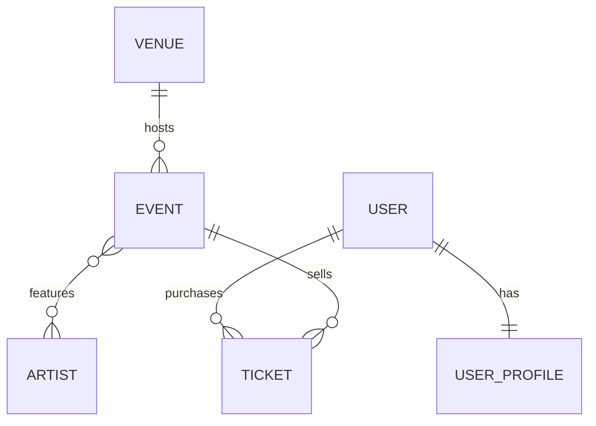

# PulsePass — capa de persistencia

Plataforma de eventos, artistas y entradas. Este repositorio implementa el MVP
académico definido en el PRD de PulsePass: **solo la capa de persistencia**.

No hay capa Service ni API REST: el PRD las deja explícitamente fuera de alcance
(sección 18). El recorrido que cubre el proyecto es:

```
Modelo de negocio (PRD)
        ↓
Modelo relacional
        ↓
Flyway  (V1, V2, V3)
        ↓
PostgreSQL
        ↑
Hibernate / JPA
        ↑
Spring Data JPA
        ↑
Repository
        ↑
 ┌──────┼───────────┐
CRUD   Query       @Query
       Methods       ↓
                   JPQL
```

---

## 1. Stack

| Componente | Versión |
|---|---|
| Java | 21 |
| Spring Boot | 4.1.1 |
| Build | Maven |
| ORM | Spring Data JPA / Hibernate |
| Base de datos | PostgreSQL |
| Migraciones | Flyway |
| Pruebas | JUnit 5, AssertJ, Testcontainers |

Restricciones respetadas (sección 13 del PRD): Flyway es el único responsable
del esquema, `ddl-auto=validate`, PostgreSQL real vía Testcontainers, **sin H2**,
**sin SQL nativo** en los repositories y **sin Lombok `@Data`** sobre entidades.

---

## 2. Modelo de datos

```
Venue 1 ───── N Event
Event N ───── M Artist        (tabla asociativa event_artists)
User  1 ───── 1 UserProfile
User  1 ───── N Ticket
Event 1 ───── N Ticket
```



### Tablas

| Tabla | Tipo | Notas |
|---|---|---|
| `venues` | entidad | `UNIQUE(code)`, `CHECK (capacity > 0)` |
| `events` | entidad | `UNIQUE(event_code)`, FK a `venues`, CHECK de categoría y estado |
| `artists` | entidad | `UNIQUE(stage_name)` |
| `event_artists` | **asociativa** | PK compuesta `(event_id, artist_id)` |
| `users` | entidad | `UNIQUE(username)`, `UNIQUE(email)` |
| `user_profiles` | entidad | FK **+ `UNIQUE(user_id)`** → garantiza el 1:1 |
| `tickets` | entidad | `UNIQUE(ticket_code)`, `CHECK (price >= 0)`, dos FK |

### Dónde vive cada FK y quién es el propietario de la relación

| Relación | FK física | Propietario JPA | Lado inverso |
|---|---|---|---|
| Venue 1:N Event | `events.venue_id` | `Event` (`@ManyToOne` + `@JoinColumn`) | `Venue.events` (`mappedBy = "venue"`) |
| Event N:M Artist | `event_artists` | `Event` (`@ManyToMany` + `@JoinTable`) | `Artist.events` (`mappedBy = "artists"`) |
| User 1:1 UserProfile | `user_profiles.user_id` | `UserProfile` (`@OneToOne` + `@JoinColumn`) | `User.profile` (`mappedBy = "user"`) |
| User 1:N Ticket | `tickets.user_id` | `Ticket` | `User.tickets` |
| Event 1:N Ticket | `tickets.event_id` | `Ticket` | `Event.tickets` |

El propietario es siempre el lado que mantiene físicamente la FK.

### Tres decisiones de modelado

**Por qué `Ticket` es una entidad y no un `@ManyToMany` entre `User` y `Event`.**
Una tabla asociativa pura solo guarda el par de FK. Un ticket tiene datos
propios — `ticketCode`, `type`, `price`, `status`, `purchaseDate` — y no habría
dónde ponerlos (BR-006).

**Por qué `UNIQUE(user_id)` en `user_profiles`.** La FK sola produce una relación
1:N: nada impediría insertar dos perfiles para el mismo usuario. Es el `UNIQUE`
el que convierte la relación en un 1:1 real dentro de PostgreSQL (BR-004).

**Por qué PK compuesta en `event_artists`.** Sin ella se podría insertar dos
veces el par `(CMF-2026, Solar Beat)`, y las consultas por artista devolverían
el mismo evento repetido (AC-003).

---

## 3. Migraciones Flyway

| Archivo | Contenido |
|---|---|
| `V1__create_schema.sql` | Las 7 tablas con PK, FK, UNIQUE, CHECK e índices |
| `V2__insert_initial_artists.sql` | Catálogo: Solar Beat, Neon Waves, Caribbean Sound, Ocean Drive, Digital Pulse |
| `V3__add_streaming_url_to_event.sql` | `streaming_url VARCHAR(500)` nullable en `events` |

**Por qué `ddl-auto=validate` y no `update`.** Con `update` Hibernate deduce el
esquema del mapeo Java y lo modifica en caliente: nunca se sabe con certeza qué
estructura tiene la base, los cambios no quedan versionados y no hay forma de
reproducir el esquema desde cero. Con `validate`, Flyway crea el esquema e
Hibernate solo comprueba que su mapeo coincida; si algo no cuadra, la aplicación
**no arranca**. El error aparece al inicio y no en producción.

**Por qué V3 en lugar de editar V1.** Flyway guarda un checksum de cada
migración en `flyway_schema_history`. Editar V1 después de haberla aplicado hace
que el checksum deje de coincidir y Flyway falle en todo entorno donde ya se
ejecutó; quien tenga la base vieja nunca recibiría el cambio. El esquema se
evoluciona siempre hacia adelante (NFR-002, pregunta 4 del PRD).

---

## 4. Consultas implementadas

### Métodos heredados de `JpaRepository`

`save`, `saveAll`, `saveAndFlush`, `findById`, `findAll`, `existsById`, `count`,
`delete`, `deleteById`, `flush`.

### Query Methods

| Repository | Método | Requisito |
|---|---|---|
| `VenueRepository` | `findByCode` | FR-VEN-001 |
| | `findByCityIgnoreCase` | — |
| | `findByActiveTrueOrderByNameAsc` | — |
| | `findByCapacityGreaterThanEqualOrderByCapacityDesc` | — |
| `EventRepository` | `findByEventCode` | FR-EVT-002 |
| | `findByStatusOrderByEventDateAsc` | FR-EVT-005 |
| | `findByCategoryAndStatusOrderByEventDateAsc` | — |
| | `findByStatusAndEventDateAfterOrderByEventDateAsc` | — |
| | `findByNameContainingIgnoreCaseOrderByEventDateAsc` | — |
| | `findByVenueCodeOrderByEventDateAsc` | **FR-VEN-004** (navega relación) |
| | `findByVenueCityIgnoreCaseOrderByEventDateAsc` | navega relación |
| | `findByVenueCityIgnoreCaseAndStatusOrderByEventDateAsc` | navega relación |
| `ArtistRepository` | `findByStageNameIgnoreCase` | FR-ART-002 |
| | `findByActiveTrueOrderByStageNameAsc` | — |
| | `findByStageNameContainingIgnoreCaseOrderByStageNameAsc` | — |
| `UserRepository` | `findByEmailIgnoreCase` | FR-USR-002 |
| | `findByUsername` | FR-USR-002 |
| | `findByActiveTrueOrderByUsernameAsc` | — |
| | `existsByEmailIgnoreCase` | — |
| `UserProfileRepository` | `findByUserId` | FR-USR-003 |
| | `findByUserEmailIgnoreCase` | **FR-USR-004** (navega relación) |
| | `findByCityIgnoreCaseOrderByLastNameAsc` | — |
| `TicketRepository` | `findByTicketCode` | FR-TKT-002 |
| | `findByUserEmailIgnoreCaseOrderByPurchaseDateDesc` | **FR-TKT-006** (navega relación) |
| | `findByUserEmailIgnoreCaseAndStatusOrderByPurchaseDateDesc` | FR-TKT-006 |
| | `findByEventEventCodeAndStatusOrderByPurchaseDateAsc` | **FR-TKT-007** |
| | `findByEventEventCodeAndTypeAndStatus` | — |

Cómo leer `findByUserEmailIgnoreCaseOrderByPurchaseDateDesc`:

```
Ticket
  ↓ user
User
  ↓ email        (ignorando mayúsculas)
       ordenado por Ticket.purchaseDate descendente
```

Spring Data no encuentra una propiedad `userEmail` en `Ticket`, así que parte el
nombre y resuelve `user.email`. Si el nombre resultara ambiguo, puede forzarse el
corte con un guion bajo: `findByUser_EmailIgnoreCase...`.

### Consultas JPQL (`@Query`)

| Repository | Método | Requisito | Por qué JPQL |
|---|---|---|---|
| `ArtistRepository` | `findArtistsByEventCode` | FR-ART-003 | recorre la N:M en sentido inverso |
| `EventRepository` | `findEventsByArtistStageName` | FR-SRC-001 / AC-007 | `JOIN` sobre N:M + `DISTINCT` |
| | `findEventsByCityAndArtist` | FR-SRC-002 | dos asociaciones distintas |
| | `findRecommendedEvents` | FR-SRC-003 | cuatro filtros, `LIKE`, `DISTINCT` y orden |
| | `findByEventCodeWithArtists` | — | `JOIN FETCH` contra el problema N+1 |
| `TicketRepository` | `countTicketsByEventCodeAndStatus` | FR-TKT-008 / AC-008 | `COUNT` en la base |
| | `findTicketsOfUpcomingEvents` | FR-SRC-004 | ordena por atributo de la entidad asociada |
| | `findTicketsByUserEmailAndCity` | — | recorre tres entidades |

**Por qué JPQL escribe `Event` y no `events`.** JPQL consulta el **modelo de
objetos**, no las tablas: sus nombres son los de las entidades y sus atributos
Java. Hibernate traduce después a SQL usando el mapeo. Por eso
`join e.artists a` no menciona nunca `event_artists`, aunque el SQL generado sí
la use.

**Criterio para elegir el mecanismo.**

```
¿Ya existe en JpaRepository?  ──sí──>  método heredado
              │no
              ▼
¿Consulta simple sobre atributos
 o un camino de navegación corto? ──sí──>  Query Method
              │no
              ▼
   varias asociaciones, JOIN,
   DISTINCT, COUNT o LIKE      ────────>  @Query + JPQL
```

---

## 5. Pruebas

47 pruebas de integración contra PostgreSQL real levantado por Testcontainers.

| Clase | Pruebas | Cubre |
|---|---:|---|
| `FlywayMigrationIT` | 6 | QT-001, QT-002 — Flyway aplica V1/V2/V3 y Hibernate solo valida |
| `VenuePersistenceTest` | 5 | FR-VEN-001..003, AC-001, QT-009 |
| `EventRepositoryIT` | 7 | QT-003, FR-EVT-001..006, FR-VEN-004, AC-002, AC-006 |
| `EventArtistIT` | 5 | QT-005, FR-ART-003/004, AC-003, AC-007 |
| `UserProfileIT` | 5 | QT-004, FR-USR-001..004, AC-004 |
| `TicketRepositoryIT` | 9 | QT-006, FR-TKT-001..008, AC-005 |
| `EventSearchIT` | 9 | escenario de referencia (§16), FR-SRC-001..004, AC-008 |

**Por qué Testcontainers y no H2.** H2 imita PostgreSQL, no lo reproduce. Un
`CHECK (capacity > 0)`, el comportamiento exacto de `NUMERIC(12,2)`, el orden de
un `ORDER BY` bajo la colación real o el mensaje de una violación de UNIQUE
pueden comportarse distinto. Probar contra H2 y desplegar contra PostgreSQL es
probar otra cosa (NFR-005).

**Por qué probar los constraints contra la base y no solo en Java.** Una
validación en Java protege un único camino de escritura. El `CHECK` y el `UNIQUE`
protegen la tabla frente a cualquier cliente — otra aplicación, un script, una
carga manual. Por eso `VenuePersistenceTest` comprueba que PostgreSQL rechace una
capacidad de cero, en lugar de confiar en la entidad.

**Un solo contenedor para todas las clases.** `PostgresContainerConfiguration`
declara el contenedor como `@Bean` con `@ServiceConnection` en vez de usar un
campo estático con `@Container`. Spring lo arranca y lo detiene con el contexto,
y como el contexto se cachea entre clases, las 7 comparten el mismo contenedor
en lugar de levantar uno por clase.

---

## 6. Cómo ejecutar

### Requisitos

- JDK 21
- Maven 3.9+
- Docker en ejecución (Testcontainers lo necesita; no hace falta instalar PostgreSQL)

### Pruebas

```bash
mvn clean test
```

Resultado esperado: `BUILD SUCCESS` (QT-010).

Mientras corren, en otra terminal:

```bash
docker ps
```

Debe aparecer temporalmente un contenedor `postgres:18-alpine` creado por
Testcontainers.

> **Nota sobre Surefire.** Por defecto Surefire solo ejecuta las clases que
> terminan en `Test`, `Tests` o `TestCase`, de modo que las clases `*IT`
> quedarían fuera y `mvn clean test` daría `BUILD SUCCESS` **sin haberlas
> corrido**. El `pom.xml` agrega `**/*IT.java` a los `includes` para que el
> resultado signifique lo que dice.

### Aplicación contra un PostgreSQL propio

```bash
createdb pulsepass

DB_URL=jdbc:postgresql://localhost:5432/pulsepass \
DB_USER=postgres \
DB_PASSWORD=postgres \
mvn spring-boot:run
```

Flyway aplica V1, V2 y V3 al arrancar; Hibernate valida el esquema resultante.

### Qué mirar en los logs

1. Flyway ejecutando `V1`, `V2` y `V3`.
2. Hibernate **validando** el esquema — nunca creándolo.

---

## 7. Estructura

```
pulsepass/
├── pom.xml
├── README.md
└── src
    ├── main
    │   ├── java/com/pulsepass
    │   │   ├── PulsePassApplication.java
    │   │   ├── domain
    │   │   │   ├── Venue.java
    │   │   │   ├── Event.java          EventCategory.java  EventStatus.java
    │   │   │   ├── Artist.java
    │   │   │   ├── User.java           UserProfile.java
    │   │   │   └── Ticket.java         TicketType.java     TicketStatus.java
    │   │   └── repository
    │   │       ├── VenueRepository.java        EventRepository.java
    │   │       ├── ArtistRepository.java       UserRepository.java
    │   │       ├── UserProfileRepository.java  TicketRepository.java
    │   └── resources
    │       ├── application.yml
    │       └── db/migration
    │           ├── V1__create_schema.sql
    │           ├── V2__insert_initial_artists.sql
    │           └── V3__add_streaming_url_to_event.sql
    └── test/java/com/pulsepass
        ├── support
        │   ├── PostgresContainerConfiguration.java
        │   ├── AbstractPersistenceIT.java
        │   └── TestFixtures.java
        └── repository
            ├── FlywayMigrationIT.java      VenuePersistenceTest.java
            ├── EventRepositoryIT.java      EventArtistIT.java
            ├── UserProfileIT.java          TicketRepositoryIT.java
            └── EventSearchIT.java
```

---

## 8. Definition of Done (sección 21 del PRD)

- [x] El modelo relacional implementa todas las entidades y relaciones del MVP
- [x] Las migraciones reconstruyen el esquema desde cero
- [x] Hibernate opera en modo `validate`
- [x] Todos los repositories necesarios existen y usan `JpaRepository`
- [x] Cada requisito de consulta tiene implementación y prueba
- [x] Los constraints críticos se validan contra PostgreSQL
- [x] Las pruebas de integración usan Testcontainers
- [x] `mvn clean test` finaliza sin errores
- [x] El README explica modelo, migraciones, consultas y ejecución
